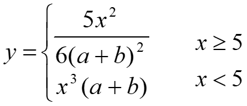
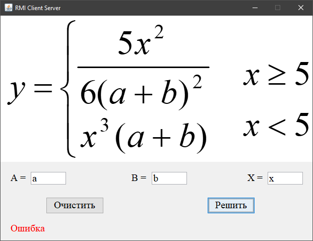
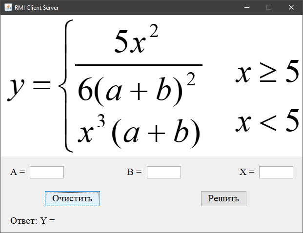
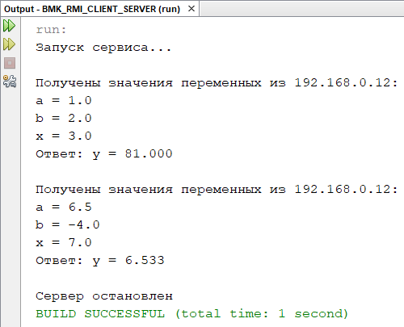

# BMK01_RMI_CLIENT_SERVER
## Разработка многоуровневых приложений
## Технология RMI
Визуальная клиент-серверная программа на Java на основе технологии RMI для распределенного расчета математического значения по заданному алгоритму.   
Лабораторная работа №4  
Вариант - 1  
  
## Расчёт значения

## Вывод ошибки

## Сброс значений

## Вывод в консоли
